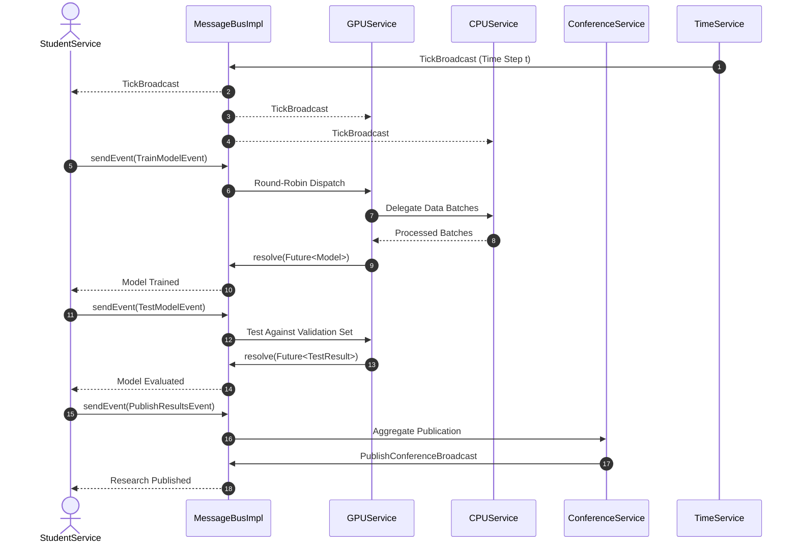

# ⚡ Concurrent Microservices Framework

[](https://www.oracle.com/java/)
[](https://maven.apache.org/)
[](#concurrency--thread-safety)
[](#architecture-overview)
[](LICENSE)

An asynchronous, high-throughput, event-driven microservices framework and compute-cluster simulation built on pure Java concurrency primitives. The framework features an in-memory, thread-safe **Publish-Subscribe / Message Bus** message broker, round-robin event load balancing, custom non-blocking/blocking `Future<T>` synchronization, and deterministic lifecycle orchestration.

---

## 📑 Table of Contents

- [Overview](#-overview)
- [Architecture Overview](#-architecture-overview)
  - [Core Microservices Infrastructure](#core-microservices-infrastructure)
  - [Message Types: Events vs. Broadcasts](#message-types-events-vs-broadcasts)
  - [Custom Future Pattern](#custom-future-pattern)
- [Domain Simulation: Distributed AI Training Cluster](#-domain-simulation-distributed-ai-training-cluster)
  - [Participating Microservices](#participating-microservices)
  - [Event & Broadcast Catalog](#event--broadcast-catalog)
  - [Lifecycle & Execution Flow](#lifecycle--execution-flow)
- [Concurrency & Thread-Safety Guarantees](#-concurrency--thread-safety-guarantees)
- [Tech Stack](#-tech-stack)
- [Project Structure](#-project-structure)
- [Getting Started](#-getting-started)
  - [Prerequisites](#prerequisites)
  - [Compilation & Building](#compilation--building)
  - [Running Tests](#running-tests)
  - [Running the Simulation](#running-the-simulation)
  - [Configuration Specification](#configuration-specification)
- [Key Engineering Highlights](#-key-engineering-highlights)
- [License](#-license)

---

## 🔭 Overview

Modern distributed systems rely heavily on decoupled, asynchronous event processing. This project implements a lightweight, in-memory **Actor-inspired microservices framework** designed to process heavy concurrent event loads with zero external broker dependencies (e.g., Kafka or RabbitMQ). 

To demonstrate its capabilities, the framework powers an end-to-end **distributed AI training and academic publication simulation**. Simulated researchers submit machine learning workloads across heterogeneous CPU and GPU clusters, manage data pipelines, evaluate inference benchmarks, and coordinate conference publication cycles driven by a centralized simulation clock.

---

## 🏛 Architecture Overview

The system is decoupled into two primary layers:
1. **Core Framework (`bgu.spl.mics`)**: Generic concurrency primitives, messaging bus, abstract service lifecycle, and future synchronization.
2. **Application Domain (`bgu.spl.mics.application`)**: Specialized microservices, hardware compute modeling, domain events, and JSON configuration parser.

```
┌─────────────────────────────────────────────────────────────────────────┐
│                              MessageBusImpl                             │
│                     (Thread-Safe Singleton Broker)                      │
│                                                                         │
│   ┌───────────────────────────┐       ┌─────────────────────────────┐   │
│   │   Round-Robin Event Map   │       │   Pub-Sub Broadcast Map     │   │
│   │  Event<T> ──> Round-Robin │       │  Broadcast ──> Set<Queues>  │   │
│   └───────────────────────────┘       └─────────────────────────────┘   │
└────────▲──────────────────▲──────────────────▲──────────────────▲───────┘
         │                  │                  │                  │
   [Event / Future]    [Event Queue]     [Broadcast Queue]   [Event / Future]
         │                  │                  │                  │
┌────────┴─────────┐ ┌──────┴──────────┐ ┌─────┴──────────┐ ┌─────┴───────┐
│  StudentService  │ │   GPUService    │ │   CPUService   │ │ TimeService │
│ (Dedicated Thrd) │ │ (Dedicated Thrd)│ │(Dedicated Thrd)│ │(Clock Thrd) │
└──────────────────┘ └─────────────────┘ └────────────────┘ └─────────────┘
```

### Core Microservices Infrastructure

- **`MessageBus` (`MessageBusImpl`)**: The central singleton message exchange coordinating all communication. It enforces encapsulation by routing messages directly into private message queues allocated to registered microservices.
- **`MicroService`**: Abstract base class representing an autonomous agent executing on its own dedicated `Thread`. Each microservice registers its message callbacks, consumes messages sequentially from its internal queue, and executes event handlers without shared mutable state.
- **Callback Loop**: Services register lambda or method-reference callbacks for specific event or broadcast types (`subscribeEvent`, `subscribeBroadcast`), yielding clean reactive syntax.

### Message Types: Events vs. Broadcasts

| Feature | `Event<T>` (1-to-1) | `Broadcast` (1-to-Many) |
| :--- | :--- | :--- |
| **Delivery Model** | Round-robin load balancing among registered subscribers. | Fan-out pub-sub to all registered subscribers. |
| **Return Value** | Returns a `Future<T>` resolved by the consumer upon completion. | Fire-and-forget (`void`); no response channel. |
| **Use Cases** | Asynchronous RPC, computational requests (e.g., `TrainModelEvent`). | Global clock ticks, notifications, shutdown signals (`TerminateBroadcast`). |

### Custom Future Pattern

Rather than depending on heavy external utilities, the framework incorporates a custom thread-safe `Future<T>` implementation that guarantees non-busy waiting and race-free synchronization:

- **`get()`**: Thread-safe blocking wait utilizing intrinsic monitors (`wait()` / `notifyAll()`).
- **`get(long timeout, TimeUnit unit)`**: Timed blocking wait to prevent thread starvation under lingering loads.
- **`resolve(T result)`**: Atomically transitions state from pending to resolved, persists the result, and wakes all awaiting consumer threads.
- **`isDone()`**: Non-blocking atomic query for completion status.

---

## 🧪 Domain Simulation: Distributed AI Training Cluster

The application layer models a multi-tenant compute cluster where student researchers submit machine learning workloads to shared hardware accelerators.



### Participating Microservices

1. **`TimeService`**: Global simulation heartbeat. Broadcasts `TickBroadcast` at configured intervals and broadcasts `TerminateBroadcast` when total simulation duration elapses.
2. **`StudentService`**: Orchestrates researcher workflows. Iterates through assigned models, dispatches `TrainModelEvent`, waits on the returned `Future`, dispatches `TestModelEvent`, and submits successful results to academic conferences.
3. **`GPUService`**: Models GPU hardware accelerators (e.g., RTX 3060, V100, A100). Splits training data into computational batches, coordinates with available CPUs for data pre-processing, and trains model parameters.
4. **`CPUService`**: Models multi-core host CPUs. Prepares raw data batches for GPU ingestion and processes validation data batches for model testing.
5. **`ConferenceService`**: Collects successful research papers submitted via `PublishResultsEvent` and periodically broadcasts accepted publications via `PublishConferenceBroadcast`.

### Event & Broadcast Catalog

| Message Identifier | Type | Payload / Result | Description |
| :--- | :--- | :--- | :--- |
| `TrainModelEvent` | `Event<Model>` | Input: Unprocessed Model<br>Resolves: Trained Model | Requests GPU/CPU cluster resources to train model weights over specified batches. |
| `TestModelEvent` | `Event<TestResult>` | Input: Trained Model<br>Resolves: `GOOD` / `BAD` result | Evaluates model accuracy against validation test sets. |
| `PublishResultsEvent` | `Event<Boolean>` | Input: Evaluated Model<br>Resolves: Submission Status | Submits validated research results for an upcoming conference. |
| `TickBroadcast` | `Broadcast` | Current Tick (`int`) | Clock pulse notifying all active services to advance internal state. |
| `PublishConferenceBroadcast` | `Broadcast` | List of Accepted Models | Propagates conference publication outcomes to all student services. |
| `TerminateBroadcast` | `Broadcast` | None | Signals all microservices to unregister, flush resources, and safely exit. |

---

## 🔒 Concurrency & Thread-Safety Guarantees

The core engine was engineered from the ground up to prevent race conditions, deadlocks, and thread starvation:

- **Per-Service Queuing**: Every microservice owns a dedicated, thread-safe queue (`BlockingQueue<Message>`). Senders push to the queue without locking the receiving service's thread execution loop.
- **Round-Robin Event Routing**: Subscriptions for each `Event` type are managed in thread-safe circular queues. When an event is dispatched, the bus advances the pointer atomically, guaranteeing fair distribution across worker instances.
- **Fine-Grained Synchronization**: Granular lock scopes and thread-safe concurrent collections (`ConcurrentHashMap`, atomic primitives) minimize synchronization overhead and eliminate global lock contention on the message bus.
- **Safe Dynamic Deregistration**: When a service terminates, its associated message queue and subscription hooks are cleanly detached without invalidating in-flight events or leaving dangling futures.
- **Graceful Termination Cascade**: Upon receiving `TerminateBroadcast`, microservices drain pending cleanup actions, terminate their execution loops, and join worker threads cleanly without abrupt interruption.

---

## 🛠 Tech Stack

- **Language**: Java 11+ (Compatible with Java 8+)
- **Concurrency**: Java Concurrency Utilities (`java.util.concurrent`, custom synchronized monitors, Atomic primitives)
- **Build Tool**: Apache Maven
- **Serialization / Parsing**: Google Gson (JSON configuration ingestion)
- **Testing**: JUnit 5 / JUnit 4 (Unit testing concurrency components & message routing)

---

## 📁 Project Structure

```
SPL_project_2/
├── pom.xml                               # Maven project descriptor & dependencies
├── config.json                           # Simulation input configuration
├── src/
│   ├── main/
│   │   └── java/
│   │       └── bgu/
│   │           └── spl/
│   │               └── mics/
│   │                   ├── Broadcast.java              # Marker interface for 1-to-many messages
│   │                   ├── Callback.java               # Functional callback handler
│   │                   ├── Event.java                  # Typed 1-to-1 event contract
│   │                   ├── Future.java                 # Thread-safe async result container
│   │                   ├── Message.java                # Top-level message interface
│   │                   ├── MessageBus.java             # Central broker interface
│   │                   ├── MessageBusImpl.java         # Singleton message broker implementation
│   │                   ├── MicroService.java           # Abstract worker base class
│   │                   └── application/
│   │                       ├── Main.java               # Application bootstrap & lifecycle orchestrator
│   │                       ├── messages/               # Concrete Events & Broadcasts
│   │                       │   ├── PublishConferenceBroadcast.java
│   │                       │   ├── PublishResultsEvent.java
│   │                       │   ├── TerminateBroadcast.java
│   │                       │   ├── TestModelEvent.java
│   │                       │   ├── TickBroadcast.java
│   │                       │   └── TrainModelEvent.java
│   │                       ├── objects/                # Domain models (GPU, CPU, Student, Model, etc.)
│   │                       │   ├── CPU.java
│   │                       │   ├── Cluster.java
│   │                       │   ├── ConfrenceInformation.java
│   │                       │   ├── Data.java
│   │                       │   ├── GPU.java
│   │                       │   ├── Model.java
│   │                       │   └── Student.java
│   │                       └── services/               # Concrete Microservices
│   │                           ├── CPUService.java
│   │                           ├── ConferenceService.java
│   │                           ├── GPUService.java
│   │                           ├── StudentService.java
│   │                           └── TimeService.java
│   └── test/
│       └── java/
│           └── bgu/
│               └── spl/
│                   └── mics/
│                       ├── FutureTest.java             # Unit tests for custom Future implementation
│                       └── MessageBusTest.java         # Unit tests for message bus routing & pub-sub
└── README.md
```

---

## 🚀 Getting Started

### Prerequisites

- **Java Development Kit (JDK)**: Version 11 or higher installed and configured (`JAVA_HOME` set).
- **Apache Maven**: Version 3.6+ installed.

Verify your environment:
```bash
java -version
mvn -version
```

### Compilation & Building

Clone the repository and compile the project using Maven:

```bash
git clone https://github.com/your-username/concurrent-microservices-framework.git
cd concurrent-microservices-framework
mvn clean compile
```

### Running Tests

Execute unit tests covering `MessageBusImpl` routing, pub-sub behavior, and `Future` synchronization:

```bash
mvn test
```

### Running the Simulation

Execute the main simulation entry point by passing a JSON configuration file:

```bash
mvn exec:java -Dexec.mainClass="bgu.spl.mics.application.Main" -Dexec.args="config.json"
```

### Configuration Specification

The simulation behavior is entirely configurable via `config.json`. Below is an annotated structure:

```json
{
  "Students": [
    {
      "name": "Grace Hopper",
      "department": "Computer Science",
      "status": "PhD",
      "models": [
        {
          "name": "TransformerNLP",
          "type": "Text",
          "size": 20000
        }
      ]
    }
  ],
  "GPUS": ["RTX3060", "V100"],
  "CPUS": [4, 8],
  "Conferences": [
    {
      "name": "NeurIPS",
      "date": 1000
    }
  ],
  "TickTime": 10,
  "Duration": 250
}
```

- `Students`: Array of researchers, their academic status (`MSc` / `PhD`), and candidate models.
- `GPUS`: Computational capacity definitions (`RTX3060`, `RTX2080`, `V100`).
- `CPUS`: Core counts for computational preprocessing units.
- `Conferences`: Deadlines (tick count) and names of academic venues.
- `TickTime`: Millisecond duration of each clock tick.
- `Duration`: Total simulation duration before `TimeService` broadcasts termination.

---

## 💡 Key Engineering Highlights

1. **Pure In-Memory Pub/Sub Engine**: Zero reliance on heavyweight external message queue servers; low runtime overhead and zero network serialization costs.
2. **Actor-Model Encapsulation**: Services never invoke methods on other services directly, preventing state corruption and shared-memory race conditions.
3. **Lock Contention Optimization**: Employs fine-grained locks around individual service queues and subscription sets rather than synchronizing the entire message bus.
4. **Resilient Future Contract**: The custom `Future<T>` pattern guarantees deterministic retrieval with both blocking and timeout-based semantics.
5. **Declarative Architecture**: Full separation of concerns between messaging abstractions, infrastructure services, and domain simulation entities.

---

## 📄 License

This project is licensed under the [MIT License](LICENSE) - see the LICENSE file for details.
